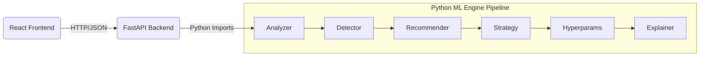

<div align="center">
  <h1>🧠 LayerWise</h1>
  <p><strong>Explainable Transfer Learning Advisor for Image Classification</strong></p>

  <p>
    Upload a labeled dataset → get a justified fine-tuning plan.<br>
    <i>Every recommendation is traceable to a specific rule and your actual data.</i>
  </p>

  <p>
    <a href="#-progress--roadmap"></a>
    <a href="#-testing-implemented-features-m1"></a>
    
  </p>
</div>

---

## Description

LayerWise is an **explainable decision support tool** for transfer learning in image classification, not an opaque AutoML runner. Where traditional AutoML tools optimize purely for metrics while hiding the engineering decisions, LayerWise optimizes for **understanding**. It builds genuine intuition by exposing every fired rule that leads to its recommendations.

### What Gap It Fills
| Traditional AutoML | LayerWise |
|:---|:---|
| Hides decisions in a black box | **Shows every fired rule** explicitly |
| Optimizes only the target metric | **Optimizes understanding** and workflows |
| Teaches you nothing about the data | **Builds genuine intuition** and expertise |

---

## Target Audience

- **ML Practitioners:** Engineers who can write a training loop but struggle with configuration decisions and hyperparameter tuning.
- **Domain Experts & Researchers:** Radiologists, biologists, GIS analysts, and graduate students fine-tuning models on specific, non-standard datasets.
- **Educators:** Teachers and mentors who need concrete, explainable transfer learning pedagogy to guide students.

---

## Why It Exists (The Problem)

When fine-tuning models, practitioners often fall into three common failure modes:
1. **Freeze everything:** Results in underfitting; the model never adapts to the target domain.
2. **Unfreeze everything:** Leads to catastrophic forgetting due to aggressive learning rates.
3. **Copy tutorial code:** Adopting a configuration built for a dataset that looks nothing like the target data.

AutoML tools bypass these problems rather than solving them—providing no diagnostic information and no fundamental understanding of *why* an approach failed. LayerWise exists to break this cycle by being entirely transparent.

---

## Capabilities and Features

### Currently Implemented
* **Dataset Analyzer (M1) - [Completed]**
  * Outputs `DatasetProfile`: Class counts, imbalance ratio, image size statistics, grayscale ratio, estimated dataset footprint, and pixel stats.
  * Identifies and catalogs corrupted files without silently skipping them.
  * Explicitly flags severe imbalances (e.g., `imbalance_ratio > 5.0`).
  * Explicitly flags high uncertainty on small datasets (fewer than 300 samples).

### Upcoming Features (MVP Roadmap)
* **Domain Detector:** Identifies dataset context (e.g., natural, medical, satellite, document, microscopy).
* **Model Recommender:** Scores and ranks top candidate architectures based on fired rules.
* **Freeze Strategy:** Recommends named layer groups and yields copy-pasteable PyTorch optimizer code.
* **Hyperparameter Recommendation:** Suggests starting points for LR, batch size, epochs, optimizer, and scheduler.
* **Explanation Engine:** Translates fired rules into natural language, referencing your actual dataset metrics.
* **Full-Stack Application:** FastAPI backend integrated with a React frontend dashboard.

---

## Project Architecture



**Core Architectural Invariants:**
- `engine/` contains zero web dependencies—it is fully testable from the CLI without a server.
- `api/` imports strictly from `engine/`; never the reverse.
- **Routers only:** Validate request → Call service → Return response.
- **Frontend components only:** Receive props → Render view.

---

## Methodology & Dev Standards

LayerWise follows strict engineering workflows:

**Per-Milestone Build Sequence:**
1. Define the output dataclass in `engine/models/`.
2. Write unit tests (they will start off failing—that is by design).
3. Implement the feature logic until all tests pass.
4. Write a CLI wrapper script in `scripts/`.
5. Integrate the module into `pipeline.py`.

**Rule Engine Philosophy:**
Every automated decision produces a `FiredRule` log. This forms the audit trail that the Explanation Engine uses. **All outputs must reference actual dataset numbers.**
* *Rejected:* "Use a smaller learning rate"
* *Accepted:* "5e-4 recommended — your 400-sample dataset risks overfitting at 1e-3"

---

## Progress & Roadmap

**Overall MVP Progress: ~11% (1/9 Milestones)**

```text
M1  ████████████  Dataset Analyzer     COMPLETE
M2  ░░░░░░░░░░░░  Domain Detector      Weeks 3–4
M3  ░░░░░░░░░░░░  Model Recommender    Weeks 4–5
M4  ░░░░░░░░░░░░  Freeze Strategy      Weeks 5–6
M5  ░░░░░░░░░░░░  Hyperparameters      Weeks 6–7
M6  ░░░░░░░░░░░░  Explanations         Week 8
M7  ░░░░░░░░░░░░  FastAPI Backend      Weeks 9–10
M8  ░░░░░░░░░░░░  React Frontend       Weeks 11–12
M9  ░░░░░░░░░░░░  MVP Integration      Week 13
M10 ░░░░░░░░░░░░  LLM + Q&A           Phase 2
M11 ░░░░░░░░░░░░  Grad-CAM + Export   Phase 2
```

> **Phase 2 (Post-MVP):** LLM integration via Claude API for narrating output, Q&A chat panels, Grad-CAM overlays, and automated PDF report exports.

---

## Testing Implemented Features (M1)

Since Module 1 (Dataset Analyzer) is complete, you can test it directly on your data:

### 1. Setup Environment
```bash
git clone <repo-url> layerwise && cd layerwise
python3.11 -m venv .venv && source .venv/bin/activate
pip install -e '.[dev]'
cp .env.example .env
python scripts/generate_fixtures.py
```

### 2. Run the Dataset Analyzer (M1)
```bash
python scripts/analyze_dataset.py --path ./my_dataset --output profile.json
```
**Example Output:**
```json
{
  "n_classes": 3,
  "total_samples": 847,
  "samples_per_class": { "cat": 423, "dog": 400, "rabbit": 24 },
  "imbalance_ratio": 17.6,
  "median_image_size": [512, 512],
  "grayscale_ratio": 0.04,
  "estimated_mb": 112.4,
  "corrupted_files": []
}
```

### 3. Run the Test Suite
LayerWise maintains a strict testing pyramid. You can run all implemented tests using `pytest`:

```bash
# Run lightning-fast unit tests (< 1s/file)
pytest tests/unit/ -v

# Run unit and integration tests
pytest tests/unit/ tests/integration/ -v

# Run test coverage on the engine module
pytest tests/unit/ --cov=engine --cov-report=term-missing
```

---
*LayerWise is an independent decision support tool built for explainability.*